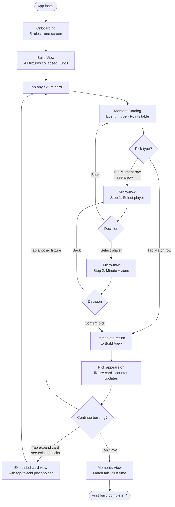
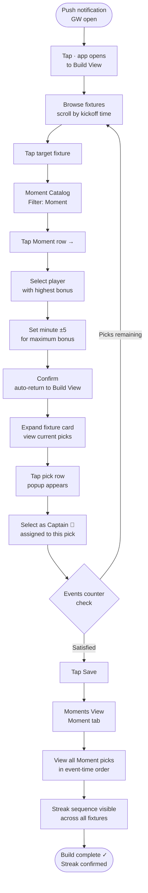
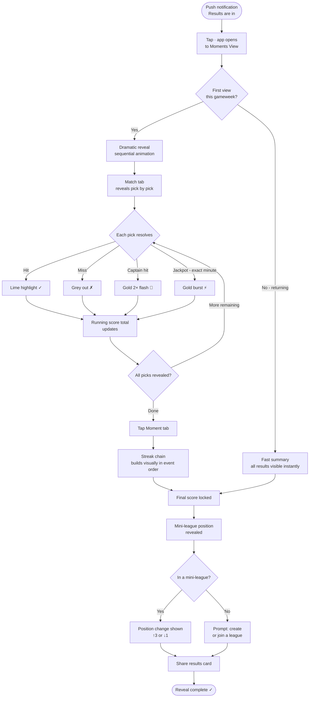
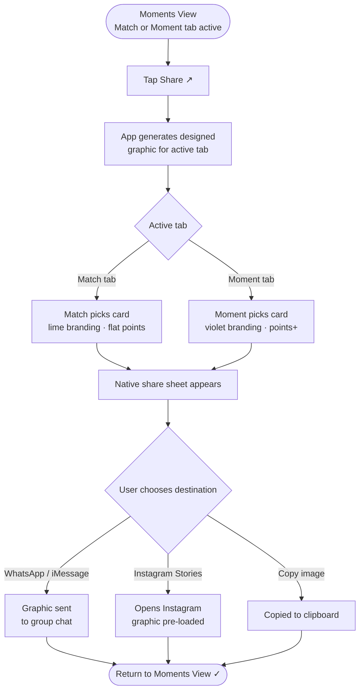
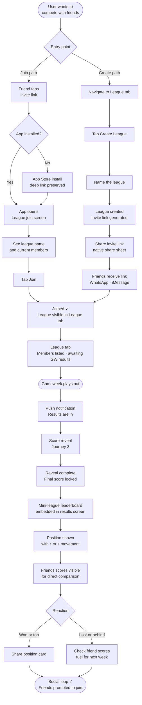

# UX Design Specification — football-prediction-app

**Author:** Sean
**Date:** 2026-04-23

---

## Executive Summary

### Project Vision

A free-to-play mobile prediction game that captures the thrill of betting accumulators — stacking predictions, watching them land or miss — without real money, age restrictions, or gambling stigma. Users predict match moments across all Premier League fixtures in a gameweek using a squad of 20 tokens. Two prediction types create layered depth: Match Moments (binary accumulator-style outcomes) and Precision Picks (event + player + exact minute + confidence window). Points are derived from betting odds APIs, inheriting market-calibrated difficulty. The core loop is: Build → Lock → Watch → Reveal → Compete.

### Target Users

| Persona | Archetype | Core Need | Tech Comfort | Key UX Requirement |
|---|---|---|---|---|
| **Jake** (22) | Casual Fan | Fun with mates, low effort | Moderate — uses apps daily, not a power user | Fast onboarding, Quick Pick safety net, clear point values |
| **Priya** (29) | Strategist | Depth, skill expression, optimisation | High — data analyst, FPL veteran | Transparent scoring, streak visibility, detailed breakdowns |
| **Dan** (25) | Social Organiser | Banter, group competition | Moderate — social-first, shares everything | Easy league creation, shareable invite links, leaderboard prominence |

### Key Design Challenges

1. **Complexity management** — Two prediction types with different input requirements must feel unified and simple. A casual user building 20 picks across 10 matches cannot feel overwhelmed.
2. **Information density** — Moment cards must communicate event type, team, point value, and prediction type without clutter. Precision Picks add player, minute, and window inputs.
3. **Score reveal as emotional payoff** — The end-of-gameweek reveal is the product's climactic moment. It must distinguish hits, misses, timing bonuses, exact minute jackpots, streak multipliers, and captain doubling with clear visual hierarchy — not a data dump.
4. **Onboarding two mechanics in <60 seconds** — Users must grasp both Match Moments and Precision Picks, plus captain, streaks, and the 20-token squad, without a wall of text.

### Design Opportunities

1. **Match Builder as ritual** — Squad building can feel like assembling a betting slip or packing a matchday squad. Satisfying interaction patterns make the build process feel like gameplay, not admin.
2. **Streak visualisation** — A timeline or chain showing how Precision Pick streaks built and broke across the gameweek — a signature UI element unique to this product.
3. **Confidence window as physical gesture** — The ±5/10/15 min window represented as a slider, ring, or pinch gesture — making the risk/reward tradeoff tactile and intuitive.
4. **Accumulator-style stacking** — Visual stacking of predictions (like a betting slip growing) creates anticipation and mirrors the dopamine loop the product is designed around.

## Core User Experience

### Defining Experience

The core interaction is **building a 20-token squad in the Match Builder**. Every gameweek, users curate a set of predictions across all Premier League fixtures — mixing Match Moments (binary outcomes) with Precision Picks (event + player + minute + window). This is the primary act of skill expression and the moment where users invest their attention. Everything else — reveal, leaderboards, mini-leagues — exists to pay off the choices made here.

The Match Builder must feel like assembling a betting accumulator: each card added raises the stakes, builds anticipation, and creates a personal narrative for the gameweek. The squad is not a form to fill — it's a story the user is writing about the weekend's football.

### Platform Strategy

- **Cross-platform mobile app** — iOS 15+ and Android 10+
- **Portrait-only**, touch-first interaction design
- **Online-only** — all state server-side, thin client over API
- **No exotic permissions** — network + push notifications only
- **Target <50MB** download — no heavy assets
- **Deep link support** — Universal Links (iOS) / App Links (Android) for mini-league invites

### Effortless Interactions

| Interaction | Design Intent |
|---|---|
| **Adding a Match Moment** | One-tap selection from moment catalog. Card shows point value upfront. No secondary inputs. |
| **Building a Precision Pick** | Guided micro-flow: select event → select player → pick minute → set window. Each step is one interaction, not a form. |
| **Squad auto-ordering** | Predictions self-sort by chronological minute within each match, and matches sort by kickoff time. The squad reads like a timeline — a 17th-minute Precision Pick appears before a 30th-minute goal prediction. The user sees their gameweek narrative building in order. |
| **Quick Pick** | One tap fills remaining empty slots. Feels like a safety net, not a lesser choice. Users can then edit individual picks. |
| **Captain selection** | Long-press or dedicated icon on any card to designate as Captain. Visual crown/star indicator. One captain at a time — selecting a new one deselects the old. |
| **Removing/replacing a pick** | Swipe-to-remove or tap-to-replace. No confirmation dialogs for pre-deadline changes. |
| **Streak sequence visibility** | Squad summary shows Precision Picks in real-world event time order across matches, so strategists can visualise and optimise their potential streak sequence before submitting. |

### Critical Success Moments

1. **First Match Builder completion (Jake's moment)** — A new user fills 20 tokens and submits without confusion. If they bounce here, nothing else matters. Quick Pick exists as the escape hatch: "don't know enough? one tap, you're in."

2. **Score reveal (the centrepiece)** — The notification lands: "Your results are in." The reveal screen is the emotional payoff of the entire gameweek. It must be captivating and visual — not a table of numbers. Moments reveal sequentially or with animation: greyed misses, green hits, gold flashes for exact-minute jackpots, streak chain building visually, captain 2x highlighted. This is the screen users screenshot and share. Supports two modes: dramatic first-view animation AND a fast summary for returning users.

3. **Mini-league leaderboard (Dan's moment)** — After the reveal, the mini-league leaderboard is embedded in the results flow — not a separate tab. Position changes (up/down arrows), relative movement, and the ability to see who you beat are front and centre.

4. **Streak realisation (Priya's moment)** — A strategist sees their Precision Picks chain together across matches in real-world event order, multipliers stacking. The streak visualisation must make this feel earned and visible — not buried in a tooltip.

### Experience Principles

1. **Sharp, not cute** — Sophisticated visual language that respects intelligence without being sterile. Clean typography, confident colour palette, premium sports-app aesthetic. Not a kids' game, not a spreadsheet — think betting app confidence without the gambling.

2. **Intuitive by structure** — The UI teaches through interaction, not instruction. Cards self-order by minute. Prediction types are visually distinct (different colour, shape, or icon for Match Moments vs Precision Picks). Streak sequences are visible during build. Users learn by doing.

3. **Build is gameplay** — The Match Builder is not a setup step before the game — it IS the game. Supports both speed (Quick Pick, one-tap adds) and strategy (streak sequencing, deliberate captain placement). Squad preview is screenshot-friendly for pre-deadline sharing.

4. **Reveal is reward** — The score reveal screen is the product's visual centrepiece. Dramatic first-view animation with fast summary mode for returning users. Mini-league leaderboard embedded in the results flow. Deserves the most design attention, the richest animation, and the clearest information hierarchy.

5. **Depth on demand** — Surface simple, drill for detail. A moment card shows its point value; tap for the scoring breakdown (base odds points + timing bonus tier + player bonus + captain 2x + streak multiplier position). Casual users see enough; strategists always find more. Detailed views are screenshot-friendly and shareable.

6. **Shareable by default** — Every key screen (squad preview, score reveal, leaderboard position) is screenshot-friendly or has native share. The app generates its own social content. The product is its own acquisition channel.

## Desired Emotional Response

### Primary Emotional Goals

| Emotion | When | Description |
|---|---|---|
| **Cleverness** | During build | "I see something others don't." Picking minute 23 for a Saka goal because you've watched Arsenal's patterns. The feeling of football knowledge being rewarded. |
| **Committed anticipation** | At deadline lock | The build window closes at first kickoff — your picks are frozen whether you're ready or not. The butterflies of a transfer deadline slamming shut. No button press; the clock takes your agency. |
| **Ambient tension** | During matches | The app isn't open, but it's in your head. "That corner at minute 34 — was that in my window?" Football becomes more engaging because your predictions are riding on it. |
| **Cascading excitement** | At reveal | Hits land one by one. Greyed misses, green hits, gold jackpots. The streak building. The captain 2x. Like watching an accumulator come in — except you earned it through knowledge. |
| **Social validation** | At leaderboard | You beat your mates, or you're already planning next week. Either way, it's fuel for the group chat. |

### Emotional Journey Mapping

| Stage | User State | Target Emotion | Design Implication |
|---|---|---|---|
| **Onboarding** | Curious but sceptical | Confidence + intrigue | Tutorial must feel fast and empowering, not patronising. "I get this, and it sounds fun." |
| **First build** | Tentative, exploring | Growing confidence | Quick Pick as safety net. Card point values visible. No dead ends. |
| **Experienced build** | Strategic, deliberate | Cleverness + agency | Streak sequencing, captain placement, odds-value hunting. The build becomes a craft. |
| **Pre-deadline** | Reviewing, second-guessing | Playful tension | Squad summary shows the full picture. Last-minute swaps feel easy. The countdown creates urgency. |
| **Deadline lock** | Passive — clock runs out | Committed anticipation | No submit button drama. The deadline passes and your picks are frozen. A subtle visual/notification: "Your squad is locked. Good luck." |
| **During matches** | Watching football, mentally tracking | Ambient tension | No live scoring in MVP — the tension lives in the user's head, not the app. |
| **Reveal notification** | Anticipation spike | Eager excitement | Push notification: "Your results are in." The user opens the app knowing something is waiting. |
| **Score reveal** | Engaged, reactive | Cascading excitement → satisfaction or "next time" | Sequential reveal with visual drama. Hits feel earned. Misses feel like "nearly." Never punishing. |
| **Leaderboard check** | Competitive | Social validation or competitive fire | Position relative to friends. Movement arrows. "I beat Chris" matters more than absolute score. |
| **Post-gameweek** | Reflective | Anticipation for next week | "I'll do better next time" or "wait till the group sees this." Either way, they're coming back. |

### Micro-Emotions

| Desired | Avoided | Design Response |
|---|---|---|
| **Confidence** | Confusion | Point values always visible. Two prediction types visually distinct. No hidden rules. |
| **Cleverness** | Randomness | Scoring rewards knowledge (timing precision, player selection). Skill expression is real. |
| **Excitement** | Indifference | Reveal uses animation, colour, and pacing. Never a flat list of numbers. |
| **Belonging** | Isolation | Mini-leagues from day 1. Leaderboard embedded in results. Share is one tap away. |
| **Pride** | Embarrassment | Premium aesthetic. Sharp, not cute. Using this app feels like being in the know, not playing a kids' game. |
| **Anticipation** | Anxiety | No real money. 0 points for wrong picks, never negative. The worst outcome is "better luck next week." |

### Design Implications

| Emotional Goal | UX Design Response |
|---|---|
| **Cleverness during build** | Show point values upfront. Let users see value asymmetries across fixtures. Make the moment catalog browsable and filterable so informed choices feel natural. |
| **Committed anticipation at deadline** | Countdown timer visible during build window. Subtle lock animation or notification when deadline passes. No dramatic "are you sure?" — the clock just runs out. |
| **Ambient tension during matches** | No live scoring in MVP. The absence of information IS the design — users watch football with their picks in mind. Post-MVP, live scoring could amplify this. |
| **Cascading excitement at reveal** | Sequential card-by-card reveal with distinct visual states: grey (miss), green (hit), gold (exact minute), chain link (streak), crown (captain 2x). Pacing matters — don't dump all 20 at once. |
| **Social validation at leaderboard** | Mini-league leaderboard shows position change, not just position. "↑3" or "↓1" next to your name. Friends' scores visible for comparison. |
| **Pride in the product** | Premium visual language throughout. No cheap gamification tropes (spinning wheels, confetti explosions). Celebration is restrained and confident — a gold flash, not a firework show. |

### Emotional Design Principles

1. **Earned, not lucky** — Every positive emotion should connect to a user decision. The exact-minute jackpot feels amazing because YOU picked that minute. Scoring rewards knowledge, not randomness.

2. **Tension without stakes** — The app creates the emotional arc of gambling (anticipation → commitment → outcome) without financial risk. The worst feeling is "I'll do better next week," never "I lost money."

3. **Celebration with restraint** — Victories are acknowledged with confident, premium visual feedback — a gold flash, a streak chain lighting up — not cartoon confetti or bouncing icons. The aesthetic respects the user's intelligence.

4. **Social fuel, not social pressure** — Mini-leagues and shareability create banter and competition, not obligation. Missing a gameweek means missing out, not letting people down.

5. **The clock decides** — The deadline lock is an emotional design feature, not just a rule. The moment your picks freeze creates committed anticipation that lasts until the reveal. The app doesn't ask "are you sure?" — the whistle blows and you're in.

## UX Pattern Analysis & Inspiration

### Inspiring Products Analysis

#### Betting Apps (Bet365, Sky Bet, Paddy Power)

**What they nail:**
- **Bet slip as accumulator builder** — adding selections is one tap. The slip grows at the bottom of the screen. Running total always visible. This is the closest UX analogue to our Match Builder.
- **Information density done right** — odds, markets, and match info packed into scannable rows without feeling cluttered. Users process a lot of data quickly because the hierarchy is consistent and learnable.
- **Speed of interaction** — experienced users can build a 10-leg accumulator in under a minute. No unnecessary confirmation steps, no animations blocking the flow.
- **No gamification** — betting apps don't need bouncing icons or achievement badges. The content IS the engagement. The odds, the potential payout, the risk. Clean and functional.

**What to adopt:** Bet slip interaction model for the Match Builder. Persistent squad summary (like a bet slip) anchored at the bottom or accessible via a tab. One-tap adds for Match Moments. Running token count always visible.

**What to avoid:** Betting apps are visually dense and assume expertise. Our onboarding needs to be gentler without patronising.

#### Fantasy Premier League (FPL)

**What they nail:**
- **Ritual engagement** — weekly deadline, squad management, transfer decisions. Users come back on a rhythm because the gameweek cycle creates natural return triggers.
- **Leaderboard obsession** — mini-leagues are FPL's stickiest feature. The product is social competition disguised as fantasy football.
- **Depth without forced complexity** — a casual user can pick 11 players and play. A hardcore user can track xG, fixture difficulty, and differential ownership. Same app, different depths.
- **Clean, functional UI** — not beautiful, not ugly. It works. Information is where you expect it. No surprises.
- **Data-rich player cards** — tap a player and see form, fixtures, ownership %, points history. Data guides selection without being forced on the user.

**What to adopt:** Mini-league structure, gameweek rhythm, depth-on-demand philosophy. The "same app, different depths" approach maps exactly to Jake vs Priya. Data-informed selection via drill-down cards.

**What to avoid:** FPL's onboarding is poor — new users face a squad builder with no guidance, budget constraints, and 600+ players. Our onboarding must be dramatically better. Also, FPL's results screen is flat — just numbers in a table. Our reveal must be more engaging.

#### Sports News Apps (BBC Sport, Sky Sports, The Athletic)

**What they nail:**
- **Card-based content layout** — scannable, tappable, consistent. Match cards with scores, team badges, and key stats. This is the visual language football fans already read fluently.
- **Match-centric navigation** — fixtures grouped by date/competition. Tap a match to drill into detail. This maps to our "browse by fixture" catalog navigation.
- **Live/post-match distinction** — clear visual states for upcoming, live, and completed matches. We need similar states for open, locked, and scored gameweeks.

**What to adopt:** Card-based layout for moment catalog and fixtures. Match-centric navigation for the build phase. Familiar football visual language (team badges, fixture formatting).

### Transferable UX Patterns

| Pattern | Source | Application in Our App |
|---|---|---|
| **Bet slip accumulator builder** | Betting apps | Match Builder — persistent squad summary, one-tap adds, running token count |
| **Card-based match layout** | Sports apps | Moment catalog — filterable cards grouped by fixture, scannable point values |
| **Mini-league leaderboards** | FPL | Direct adoption — create/join via link, weekly + cumulative tables |
| **Depth-on-demand information** | FPL | Surface: point value on card. Drill: full scoring breakdown on tap |
| **Data-informed selection cards** | FPL player cards | Moment card drill-down shows contextual historical data to guide picks (see below) |
| **Consistent row/card hierarchy** | Betting apps | Moment cards follow a fixed layout: icon, event name, team, points. Always the same structure, always scannable. |
| **Deadline countdown** | FPL + betting | Visible countdown to first kickoff. No surprises. |

### Contextual Data Hints (Moment Card Drill-Down)

**Concept:** When a user taps into a moment card detail view, show a one-line historical stat summary and a minimal visual (sparkline or dot history) to inform their decision. The surface stays clean; the depth is one tap away.

**Examples:**
- **BTTS — Chelsea vs Arsenal:** "BTTS hit in 7 of Chelsea's last 10 home matches" + dot chart (✓✓✗✓✓✓✗✓✓✓)
- **Over 2.5 Goals — Liverpool vs Spurs:** "3+ goals in 5 of last 6 meetings" + sparkline of goals per meeting
- **Yellow Cards — Arsenal match:** "Arsenal avg 2.1 yellows/match this season" + mini bar chart of recent matches
- **First Goal — Man City:** "City scored first in 8 of last 10 home games" + dot history

**Data Source:** The app already ingests match event data (goals, cards, corners, subs with player + minute) every gameweek for scoring. By storing this data, the app builds its own historical dataset over time — zero additional API cost. No external historical data API required. By gameweek 5-6, trends become meaningful. By mid-season, the data is genuinely useful for informed picks.

**Visualisation:** Simple ✓/✗ dot sequence only. Did BTTS happen in Chelsea's last tracked matches? ✓✗✓✓✗. No percentages, no averages, no sparklines, no bar charts. Just dots — instant to read, no interpretation needed.

**Design Rules:**
- **Surface level (moment card):** Event name, team, point value only. Clean and scannable.
- **One tap deep (card detail):** ✓/✗ dot history + full points breakdown. This is where Priya lives.
- **Accumulate as you go:** Only show data the app has collected itself through its own scoring pipeline. No external history.
- **Progressive richness:** Early in the season, data is sparse — show what's available without forcing it. As the season progresses, the cards get richer. The app improves with age.
- **No data, no filler:** If insufficient history exists for a stat, don't show a placeholder. Just show the points breakdown.

### Anti-Patterns to Avoid

| Anti-Pattern | Why It Fails | Our Response |
|---|---|---|
| **Gamification for its own sake** | Spinning wheels, achievement badges, confetti — feels cheap and juvenile for this audience. Betting app users will reject it immediately. | Restrained celebration. Gold flash for jackpots, not fireworks. No badges, no streaks-of-using-the-app. |
| **Gesture novelty without utility** | A pinch-to-scale window gesture sounds cool but may confuse users or feel fiddly on small screens. If it's not instantly intuitive, it's a liability. | Window selection (±5/10/15) uses a simple segmented control or toggle — the most boring, most reliable pattern. Only upgrade to gesture if user testing proves it's faster. |
| **Complex onboarding flows** | FPL drops you into a 600-player squad builder with no guidance. Tutorial carousels that users skip. | Show-by-doing: first build includes inline hints. Quick Pick as immediate safety net. Five rules on one screen. |
| **Hiding key information** | Some prediction apps hide scoring formulas, making results feel arbitrary. | Points visible on every card before selection. Scoring breakdown one tap away on results. |
| **Over-animated transitions** | Slow transitions between screens kill the speed of squad building. Betting app users expect instant response. | Transitions are fast or instant. Animation budget is spent on the reveal screen, not navigation. |

### Design Inspiration Strategy

**What to Adopt (proven patterns, use directly):**
- Bet slip interaction model for Match Builder
- Card-based fixture layout from sports apps
- Mini-league structure from FPL
- Consistent information hierarchy from betting apps
- Deadline countdown visibility
- Data-informed selection via drill-down cards (FPL player card model)

**What to Adapt (modify for our context):**
- Betting app density → slightly more spacious for accessibility, since our audience includes non-bettors
- FPL's depth-on-demand → apply to scoring breakdowns, streak visualisation, and historical data hints
- Sports app match cards → extend to moment cards with point values and prediction type indicators
- FPL player data cards → moment card drill-down with self-accumulated historical stats

**What to Avoid (conflicts with our principles):**
- Gamification tropes (badges, streaks-of-app-usage, spinning wheels)
- Gesture novelty without proven utility (pinch, swipe, shake)
- Heavy animation outside the reveal screen
- Assuming user expertise — betting apps can; we can't for first-time users
- Showing data that isn't there — no filler stats, no fake confidence

**Design Philosophy Summary:**
This app serves an audience fluent in betting apps and FPL. They expect **clean, fast, functional** interfaces. Every UX decision must be deliberate and justified by usability, not novelty. The interaction model borrows from betting (accumulator building) and FPL (gameweek rhythm, mini-leagues, data-informed selection) while solving the unique challenge of making two prediction types feel simple. The only screen that gets animation budget is the score reveal — because that's the emotional centrepiece. Everything else is fast, clean, and invisible. Historical match data — accumulated organically through the scoring pipeline — enriches moment cards over time, rewarding returning users with progressively better decision-support data.

## Design System Foundation

### Design System Choice

**Themeable system with full visual control** — React Native + Expo + NativeWind (Tailwind CSS for React Native).

This is a utility-first approach: no pre-built component library dictating visual style. Components are built from primitives and styled with Tailwind classes, giving complete control over the premium sports-app aesthetic while maintaining development speed.

### Rationale for Selection

| Factor | Decision Driver |
|---|---|
| **Solo developer** | Expo eliminates build toolchain complexity. One command to build, test, deploy. No Xcode/Android Studio required for most workflows. |
| **Cross-platform** | Single TypeScript codebase for iOS + Android. No double work. |
| **Visual control** | NativeWind (Tailwind) provides utility-first styling with zero opinions on visual design. No fighting against Material Design defaults to achieve the "sharp, not cute" aesthetic. |
| **Speed** | Tailwind classes are fast to write and iterate on. Expo's hot reload means instant visual feedback. |
| **Ecosystem** | TypeScript/React skills are broadly transferable. Largest community and package ecosystem in cross-platform mobile. |
| **Push notifications** | Expo Notifications handles APNs (iOS) + FCM (Android) with a unified API. |
| **Deep links** | Expo Router supports Universal Links and App Links natively — critical for mini-league invite flow. |
| **App store deployment** | Expo EAS (Expo Application Services) handles builds and submissions for both stores. |

### Implementation Approach

**Core Stack:**
- **Expo SDK** (latest) — managed workflow for build, deploy, and native API access
- **Expo Router** — file-based navigation, deep link support
- **NativeWind v4** — Tailwind CSS compiled to React Native StyleSheet
- **TypeScript** — type safety across the codebase

**UI Primitives (build, don't buy):**
- Cards, buttons, toggles, segmented controls built from React Native `View`, `Text`, `Pressable`
- Styled with Tailwind classes via NativeWind
- No third-party component library — full visual ownership

**Why no component library:**
The "sharp, not cute" principle requires visual control that pre-built libraries (Paper, Gluestack) fight against. Building from primitives is more work upfront but means every component looks exactly right from day one. For a small app (limited screen count), this is manageable.

### Customization Strategy

**Design Tokens (defined in Tailwind config):**
- Colour palette, typography scale, spacing, border radius, shadows — all defined once in `tailwind.config.js`
- Dark mode support via Tailwind's `dark:` prefix (if pursued)
- Team badge colours can be mapped as dynamic tokens

**Component Patterns:**
- **Moment Card** — the core reusable component. Fixed layout: icon + event name + team + points. Variant for Match Moment vs Precision Pick (visual distinction via colour/icon).
- **Squad Summary** — persistent bottom sheet or tab showing current 20-token squad with running count.
- **Segmented Control** — for window selection (±5/10/15 min). Simple, reliable, boring-on-purpose.
- **Leaderboard Row** — consistent row with rank, name, score, position change indicator.
- **Reveal Card** — animated variant of the moment card for the score reveal screen. This is the one component that gets animation budget.

**Animation Strategy:**
- Navigation transitions: instant or minimal (default Expo Router behaviour)
- Score reveal: sequential card animation using `react-native-reanimated` — the only screen that justifies animation investment
- Micro-interactions: subtle haptic feedback on card add/remove (Expo Haptics)
- Everything else: static, fast, no decoration

## Defining Experience

### The One-Line Experience

**"Pick your moments. Build your squad. Find out if you were right."**

The defining interaction is the Match Builder — assembling a 20-token squad of predictions across all Premier League fixtures in a gameweek. Users describe it as: "It's like building a bet, but you're predicting when things happen, and it's free."

### User Mental Model

Users arrive with a **betting accumulator mental model**: browse markets, add selections to a slip, review, commit. This is the foundation we build on.

| Mental Model Element | User Expectation | Our Mapping |
|---|---|---|
| Markets | Odds for different outcomes | Moment catalog with point values |
| Bet slip | Selections stack up | Squad summary (20 tokens) |
| Odds | Higher odds = higher payout | Higher points = harder prediction |
| Accumulator | Multiple selections, all must hit | Squad of 20, each scored independently |
| Cash out / edit | Change before kickoff | Edit freely until deadline lock |

**Where the mental model breaks:** The Precision Pick flow (event → player → minute → window) has no direct analogue in betting. Users understand "Saka to score anytime" from betting, but "Saka to score at minute 23 ±5 min" is new. The minute + window mechanic must be introduced gently — the segmented control (±5/10/15) and minute picker need to feel as obvious as tapping an odds button.

### Success Criteria

| Criteria | Measurement |
|---|---|
| **Speed** | A returning user can build a full 20-token squad in under 5 minutes |
| **First-time completion** | A new user completes their first squad (with Quick Pick help) without abandoning |
| **Type distinction** | Users correctly understand the difference between Match Moments and Precision Picks by their second gameweek — without re-reading rules |
| **No dead ends** | At no point during the build can the user get stuck or confused about what to do next |
| **Token awareness** | User always knows how many tokens they've used (e.g., "14/20") and how many remain |
| **Confidence** | User feels informed, not overwhelmed, when browsing the moment catalog |

### Experience Mechanics — Match Builder Flow

**1. Initiation — "GW{n} is open"**
- Push notification: "Gameweek {n} is open! Build your squad before {deadline}."
- User opens app → lands on Match Builder screen (or home screen with prominent "Build Squad" CTA)
- Gameweek header shows: deadline countdown, token count (0/20)

**2. Browse — Fixture-first navigation**
- Fixtures listed as cards, sorted by kickoff time
- Each fixture card shows: team badges, kickoff time, number of available moments
- Tap a fixture → expands or navigates to that fixture's moment catalog
- Moment catalog is filterable: by type (Match Moment / Precision Pick), by event category (goals, cards, corners)

**3. Select — Two distinct flows**

**Match Moment (one tap):**
- User sees card: icon + event name + team(s) + point value
- Tap → added to squad immediately. Card shows "Added ✓"
- Token count updates: "1/20"

**Precision Pick (guided micro-flow):**
- User taps a Precision Pick event (e.g., "⚽ Arsenal score")
- Step 1: Select player (scrollable list, named players only — selection is mandatory)
- Step 2: Pick minute (number input or scroll wheel, 1–90+)
- Step 3: Set window (segmented control: ±5 | ±10 | ±15)
- Points breakdown shown in real-time as user makes choices (base + timing bonus range)
- Confirm → added to squad. Token count updates.

**4. Review — Squad summary**
- Accessible at any time (persistent bottom bar or tab)
- Shows all selected moments, ordered by match kickoff then minute
- Each card shows: event, team, type indicator, points, window (if Precision Pick)
- Captain indicator (crown icon) on designated moment
- Streak sequence preview for Precision Picks (ordered by predicted event time)
- "Quick Pick" button fills remaining empty slots
- Long-press any card → set as Captain or remove

**5. Feedback — Continuous confidence signals**
- Token counter always visible: "{n}/20 — {remaining} to go"
- Added moments show "✓" in the catalog so users don't double-pick
- Point total preview: "Potential points: {sum}" (max possible if everything hits)
- Deadline countdown always visible

**6. Completion — Deadline lock**
- No submit button. User builds their squad. The deadline locks it.
- If user has <20 tokens at deadline: empty slots are forfeited (0 points, not auto-filled)
- If user has 0 tokens at deadline: they don't participate in that gameweek
- Lock notification: "Your squad is locked. Good luck." (subtle, not dramatic)
- Post-lock: squad is read-only. User can view but not edit.

### Novel UX Patterns

| Pattern | Status | Approach |
|---|---|---|
| **Precision Pick micro-flow** | Novel — no competitor has this | Guided 3-step flow (player → minute → window). Each step is one interaction. Real-time points preview keeps user informed. Feels like building a bet, not filling a form. |
| **Two prediction types in one squad** | Novel — unique combination | Visually distinct cards (colour/icon). Moment catalog clearly separates types. Both add to the same 20-token squad with the same tap-to-add model. |
| **Confidence window as segmented control** | Adapted — simple pattern applied to novel mechanic | ±5 / ±10 / ±15 as a 3-option segmented toggle. Points update live when user switches. No gesture novelty — just a clean, reliable control. |
| **Squad auto-ordering by minute** | Novel — narrative timeline | Predictions sort by minute within match, matches sort by kickoff. Squad reads as a chronological gameweek narrative. |
| **Streak sequence preview** | Novel — no competitor shows this | Squad summary view can toggle to show Precision Picks in real-world event time order, revealing the potential streak sequence. |

## Visual Design Foundation

### Color System

**Theme: OLED Sharp — Black + Electric Lime**

True black backgrounds are battery-efficient on OLED screens and create maximum contrast for the electric lime accent. Lime is unused territory in the sports prediction and betting space — immediate differentiation from Betfair (amber), Sky Bet (purple/yellow), Bet365 (green/black), and FPL (purple/green).

**Base Palette:**

| Token | Description | Hex |
|---|---|---|
| `bg-primary` | OLED black | `#080808` |
| `bg-surface` | Card layer | `#141414` |
| `bg-elevated` | Panel / modal layer | `#1C1C1C` |
| `text-primary` | Pure white | `#FFFFFF` |
| `text-secondary` | Mid grey | `#7A7A7A` |
| `text-muted` | Dark grey | `#404040` |
| `border-subtle` | Card borders | `#1E1E1E` |
| `border-active` | Selected state | `#B4FF32` |

**Semantic Colours:**

| Token | Purpose | Hex |
|---|---|---|
| `accent` | Brand / interactive | `#B4FF32` |
| `success` | Hit (prediction correct) | `#B4FF32` |
| `jackpot` | Exact-minute hit | `#FFD700` |
| `miss` | Prediction missed | `#303030` |
| `deadline` | Countdown / urgency | `#FF6B35` |
| `streak` | Streak chain / link | `#A78BFA` |
| `captain` | Captain indicator | `#FFD700` |

**Semantic Rationale:**
- `accent` and `success` share lime — lime = good outcome. Users learn this without being told.
- `jackpot` and `captain` share gold — both are maximum-reward states. Shared colour reinforces their elevated status.
- `deadline` orange is warm and urgent but visually distinct from lime — reads as "time pressure", not "success."
- `streak` violet is the only cool-toned semantic colour, making it visually distinctive as the chain builds during the reveal sequence.

**Dark mode only.** No light mode in MVP.

### Typography System

**Primary Typeface: Inter**

Geometric, screen-optimised, excellent tabular number rendering — critical for point values, minute inputs, and token counts. Free and open source via Expo Google Fonts.

**Type Scale:**

| Token | Size | Weight | Line Height | Usage |
|---|---|---|---|---|
| `display` | 32px | 700 | 38px | Gameweek headers, reveal score |
| `heading-1` | 24px | 700 | 30px | Screen titles, section headers |
| `heading-2` | 18px | 600 | 24px | Card titles, fixture names |
| `body` | 15px | 400 | 22px | Descriptions, onboarding copy |
| `label` | 13px | 500 | 18px | Card labels, event names |
| `caption` | 11px | 400 | 16px | Secondary info, timestamps |
| `mono-number` | 20px | 700 | 24px | Point values, token counter, minute input |

**Numeric rendering:** All point values, token counts (14/20), minute inputs, and countdown timers use Inter with `fontVariant: ['tabular-nums']` — fixed-width numbers prevent layout shifts as values change.

**Font loading:** `@expo-google-fonts/inter` loaded at app startup. Fallback: system default (SF Pro / Roboto) during load.

### Spacing & Layout Foundation

**Base unit: 8px.** All spacing derived from multiples of 8.

| Token | Value | Usage |
|---|---|---|
| `space-1` | 4px | Icon-to-label tight gaps |
| `space-2` | 8px | Default inner padding |
| `space-3` | 12px | Small gaps between elements |
| `space-4` | 16px | Standard card inner padding |
| `space-5` | 24px | Section spacing |
| `space-6` | 32px | Screen-level padding |
| `space-8` | 48px | Hero / display spacing |

**Corner Radius:**

| Token | Value | Usage |
|---|---|---|
| `radius-sm` | 4px | Chips, tags, badges |
| `radius-md` | 6px | Cards, buttons |
| `radius-lg` | 8px | Bottom sheets, modals |
| `radius-full` | 9999px | Quick Pick pill button only |

**Layout Density by Context:**

| Context | Density | Approach |
|---|---|---|
| Moment catalog | Dense | 56px row height, 8px vertical gap — bet builder list feel |
| Squad view (20 cards) | Spacious | 80px card height, 12px gap — room for event, team, points, captain indicator |
| Precision Pick flow | Spacious | Full-screen steps, one interaction per screen, no competing elements |
| Leaderboard rows | Medium | 64px row height — rank, name, score, movement all visible at once |
| Reveal cards | Spacious | Cards expand from catalog row height during animation |

**Screen layout constants:**
- Horizontal screen padding: 16px on all screens
- Bottom sheet height: 60–85% of screen height
- Tab bar height: 56px
- Safe area insets respected via Expo `SafeAreaProvider`

### Accessibility Considerations

| Consideration | Approach |
|---|---|
| **Contrast — text on black** | White on `#080808` = 21:1 (WCAG AAA). Lime `#B4FF32` on black = ~12:1 (AAA). Secondary grey `#7A7A7A` = 4.6:1 (AA pass). |
| **Contrast — text on surface** | White on `#141414` = 17:1 (AAA). |
| **Touch targets** | All interactive elements minimum 44×44px (Apple HIG). |
| **Dynamic Type** | Inter scales with iOS Dynamic Type and Android font size preferences. |
| **Colour-only states** | Hit/miss states use colour + icon (✓/✗) — never colour alone. Colour-blind safe. |
| **Lime on non-dark surfaces** | Lime is accent/highlight only — never used as text on light backgrounds. Dark-mode-only app, so this cannot occur. |

## Design Direction Decision

### Design Directions Explored

Six layout directions were explored and evaluated through Advanced Elicitation and Party Mode, covering: Bet Slip (persistent squad strip), Token Grid (squad-first), Match Cards (fixture-first), Tab Native (standard mobile navigation), Split Panel (catalog + squad always visible), and Linear Flow (step-by-step wizard).

Three personas stress-tested the directions: Jake (casual, needs clarity and low friction), Priya (strategist, needs depth and streak visibility), Dan (social, needs shareability and readable squad summary).

### Chosen Direction

**Fixture-First with accordion expansion, per-fixture Moment Catalog, and post-save Moments View.**

Two named views:

- **Build View** — pre-save, fixture-driven. The main building screen.
- **Moments View** — post-save, chronological. The in-play and sharing screen.

### Design Rationale

The fixture-driven approach maps directly to how football fans think: by match, not by event type. Grouping picks under fixture cards makes it immediately obvious which games a user has covered and which they haven't. The accordion expansion pattern keeps the main screen uncluttered while giving full pick detail on demand.

The Moment Catalog table (per fixture) mirrors the FPL player selection model that target users already know — a clean, scannable table they can filter and act on quickly. Immediate return to Build View after each selection (no confirmation dialogs) keeps the flow fast and frictionless, matching betting app interaction speed.

The post-save Moments View separates the *building* experience from the *in-play* experience cleanly. Users are in a different mental mode when they're watching football — they want to see their picks in event-time order, not by fixture. The Match/Moment tab split in the Moments View serves both casual users (Match tab, simple list) and strategists (Moment tab, chronological streak sequence).

### Implementation Approach

**Build View — Fixture Cards**

- Fixture cards listed sorted by kickoff time
- Collapsed state: team names, kickoff time, pick count badge ("3 picks") when picks exist
- Expanded state (tap populated card): accordion opens inline, showing each pick as a row with event name, type badge, and points. A "tap to add a pick" placeholder row sits below existing picks.
- Tapping a collapsed card with no picks navigates to the Moment Catalog screen for that fixture
- Tapping the "tap to add" placeholder in an expanded card also navigates to the Moment Catalog

**Build View — Events Counter + Deadline**

- Events counter ("14/20") always visible in the screen header, right-aligned, secondary text weight
- Deadline countdown contextual: not shown until under 3 hours; appears muted; turns orange (`#FF6B35`) under 1 hour; full orange strip under 15 minutes. No persistent deadline clutter during normal build windows.
- Save button always visible at bottom of Build View

**Build View — Captain Selection**

- Captain is selected at the individual pick level (not fixture level)
- Tapping an existing pick row in an expanded fixture card opens a popup: [Select as Captain] [Remove pick]
- One captain across the entire squad; selecting a new one deselects the previous
- Captain pick displays a crown (👑) icon on the row

**Prediction Types — Renamed and Visually Distinct**

| Old Name | New Name | Interaction | Visual Identity |
|---|---|---|---|
| Match Moment | **Match** | One tap → immediate return to Build View | Lime (`#B4FF32`) badge and points |
| Precision Pick | **Moment** | Tap → micro-flow (player → minute → zone) | Violet (`#A78BFA`) badge and points |

The type badge colour teaches the interaction model: lime = simple, violet = multi-step. Moment type rows in the catalog show a → arrow to signal that tapping opens a flow.

**Moment Catalog Screen**

- New screen per fixture (not a bottom sheet)
- Back navigation returns to Build View without saving if no selection was made
- Table columns: Event | Type | Points
- Event names simplified: "Goal", "BTTS", "Over 2.5", "Corner", "Red Card", "Assist", "First Goal"
- Points display: flat value for Match type (e.g. "350"), "420+" for Moment type (signals variable ceiling)
- Filter chips at top: All / Match / Moment
- Rows already added show a ✓ indicator

**Moment Micro-flow (Moment type picks only)**

Slides in left-to-right as a two-screen progression:

- **Screen 1 — Select player:** Scrollable player list with bonus points per player. Named players only — selection is mandatory. User can back-navigate to the catalog.
- **Screen 2 — Minute + Zone:** Scrollable minute picker (1–90+). Segmented zone control: ±5 (+50 pts) / ±10 (+25 pts) / ±15 (+0 pts). Running point total shown (base + player bonus + zone bonus). Confirm → auto-returns to Build View, pick appears on the fixture card.

Abandoning the micro-flow (back gesture from Screen 1) cancels the pick and returns to the catalog.

**Moments View (post-save)**

- Accessed by tapping Save on Build View
- Header shows gameweek number and lock status ("Locked · Sat 12:30")
- Two tabs at top: **Match** | **Moment**
  - Match tab: picks grouped by fixture, fixtures sorted by kickoff time
  - Moment tab: picks in chronological event-time order across all fixtures (predicted minute within match, matches sorted by kickoff) — the streak sequence view
- Share button (↗) in top right generates a designed card graphic — not a raw screenshot. Separate cards for Match picks and Moment picks, each showing event, type badge, and points with a max potential total.
- Edit button always visible at bottom — returns user to Build View

**20 Events — No Per-Fixture Limit**

Users have 20 events (picks) to allocate freely across any fixtures. No per-fixture cap. A user can put all 20 on one fixture or spread them across all gameweek matches. This accommodates varying gameweek sizes (blank weeks, double gameweeks, FA Cup disruption). The events counter ("14/20") provides the only allocation feedback needed.

**Quick Pick — Removed from MVP**

The Build View architecture does not create the empty-slot anxiety that Quick Pick was designed to solve. Users who use fewer than 20 events simply compete with fewer picks. Quick Pick is flagged as a potential v2 feature if retention data shows consistent under-use of events budget.

## Player Journey Flows

Five critical journeys covering the full product lifecycle — from first build through social retention.

| Journey | Persona | Stakes |
|---|---|---|
| 1 · New User First Build | Jake (casual) | Week 1 retention |
| 2 · Returning User Squad Build | Priya (strategist) | Depth and mastery |
| 3 · Score Reveal | All personas | The emotional centrepiece |
| 4 · Share Squad | Dan (social) | Social acquisition |
| 5 · Mini-League Create / Join / Compete | Dan (social) | Long-term retention |

---

### Journey 1 — New User First Build (Jake)

The highest-stakes flow. A new user must reach their first saved squad without confusion. Every screen transition is earned by the user's action — no autoplay, no forced tutorials.



---

### Journey 2 — Returning User Squad Build (Priya)

A deliberate, strategic build. The user arrives with intent, filters for Moment picks, assigns a captain, and uses the Moment tab to verify their streak sequence before saving.



---

### Journey 3 — Score Reveal

The emotional centrepiece. Designed as a ritual, not a data dump. Sequential animation on first view; fast summary on return visits. The reveal experience is deliberate pacing — it mirrors the emotional arc of watching an accumulator come in.



---

### Journey 4 — Share Squad

The social acquisition loop. One tap from the Moments View generates a designed graphic and surfaces the native share sheet. The path from intent to sent is two taps.



---

### Journey 5 — Mini-League Create / Join / Compete

Two entry points — creating and joining — converging on the same post-reveal leaderboard. Mini-leagues are the primary long-term retention mechanism: the reason users return every gameweek.

MVP scope: create league, generate invite link, join via link, weekly leaderboard with position movement. Cumulative season standings and league management are post-MVP.



---

### Journey Patterns

**Navigation patterns**
- Back navigation always available in multi-step flows — Moment Catalog and both micro-flow steps. No user ever gets trapped.
- Immediate auto-return to Build View after any selection. No "done" button, no confirmation dialog.
- Save and Edit are always at the bottom of their respective views — never conditional, never hidden.
- Deep links (Universal Links / App Links) preserve league join intent through App Store install.

**Decision patterns**
- No confirmation dialogs anywhere in the build flow. Every pick is immediately reversible via expand card → tap pick → Remove.
- Abandoned micro-flows (back gesture from Step 1) cancel gracefully — no partial state saved, user returns to catalog.
- One captain at a time. Selecting a new captain silently deselects the old — no popup, no friction.

**Feedback patterns**
- Picks appear on the fixture card immediately on return to Build View. No loading state.
- Events counter updates on every pick (14/20 → 15/20). Always visible in header.
- ✓ markers in the Moment Catalog prevent accidental double-picks on the same event.
- Running point total during the micro-flow (base + player + zone bonus) builds anticipation before the confirm tap.
- Score reveal animation is deliberate pacing — sequential, not instant. Each pick's resolution is a micro-moment.

### Flow Optimisation Principles

1. **2-tap minimum for a Match pick** — tap fixture → tap Match row → back in Build View. The fastest possible path to a pick.
2. **Progressive complexity** — Jake never needs to engage with the Moment micro-flow. Priya gets full depth on demand. Same app, different paths.
3. **No dead ends** — every screen has an exit. Abandoned flows restore the last clean state without data loss.
4. **Immediate visual feedback** — no action in the build flow requires a loading state. Picks are applied locally and synced in background.
5. **Reveal as ritual** — the score reveal animation is deliberate pacing, not decoration. The sequential build of results mirrors the emotional arc of watching an accumulator land. It IS the product moment.
6. **Share as first-class action** — Share ↗ is always visible in the Moments View. The path from "I want to show my mates" to "sent" is two taps.
7. **Deep link integrity** — league invite links survive App Store installation. A friend tapping a link always lands in the right place, regardless of whether the app is installed.

## Component Strategy

### Design System Coverage

The chosen stack (React Native + Expo + NativeWind) provides structural primitives only — `View`, `Text`, `Pressable`, `ScrollView`, `FlatList`, `Modal`, `TextInput`. NativeWind applies Tailwind utility classes for styling. No third-party component library is used; every UI component is custom-built from these primitives.

Additional packages contributing to component behaviour:
- `react-native-reanimated` — animation engine for the score reveal sequence
- `expo-haptics` — tactile feedback on picks and reveal states
- `expo-sharing` + `react-native-view-shot` — off-screen rendering and export for the share graphic

### Custom Components

All 15 components are custom. Organised by implementation priority.

| Component | Role | Priority |
|---|---|---|
| `TypeBadge` | Match / Moment pill indicator | P1 |
| `GameweekHeader` | GW number + events counter / lock status | P1 |
| `DeadlineStrip` | Contextual urgency banner | P1 |
| `MomentCatalogRow` | Selectable row in per-fixture event table | P1 |
| `PickRow` | Pick displayed inside expanded fixture card | P1 |
| `CaptainPopup` | Tap-on-pick modal: captain / remove | P1 |
| `FixtureCard` | Core Build View card — collapsed and expanded | P1 |
| `MicroFlowPlayerRow` | Player selection row in micro-flow Step 1 | P2 |
| `MinutePicker` | Scroll-wheel minute input in micro-flow Step 2 | P2 |
| `ZoneChip` | ±5 / ±10 / ±15 segmented zone selector | P2 |
| `PickSummaryCard` | Running point total during micro-flow Step 2 | P2 |
| `MomentsPickRow` | Pick row in Moments View — pre and post reveal states | P3 |
| `RevealCard` | Animated reveal variant of MomentsPickRow | P3 |
| `LeaderboardRow` | Mini-league results row with movement indicator | P3 |
| `ShareCard` | Generated off-screen graphic for sharing | P3 |

---

#### `GameweekHeader`

**Purpose:** Persistent header used on both Build View and Moments View. Displays the current gameweek and context-appropriate right-side content.

**Anatomy:**
```
GW 27                              14/20   ← Build View
GW 27 · Locked                             ← Moments View
```

**Variants:**

| View | Left | Right |
|---|---|---|
| Build View | GW {n} | {used}/{total} in lime `#B4FF32` |
| Moments View | GW {n} · Locked | empty |

**Typography:** Left uses `heading-2` (18px/600). Right uses `mono-number` token (20px/700) with `fontVariant: tabular-nums` so the counter doesn't shift layout as digits change.

---

#### `FixtureCard`

**Purpose:** The primary building block of the Build View. Represents one fixture and all picks made on it.

**Anatomy:**
```
┌─ [Teams] · [Kickoff] · [Pick badge] · [Chevron] ──┐  ← header row (always visible)
│  [Icon] [Pick name]        [TypeBadge]  [Points]   │  ← PickRow (expanded only)
│  [+] Tap to add a pick                             │  ← placeholder (expanded only)
└────────────────────────────────────────────────────┘
```

**States:**
- `empty` — no picks. Chevron ▸. Tap → navigate to Moment Catalog.
- `collapsed` — has picks. Pick count badge ("3 picks"). Chevron ▸. Tap → expand.
- `expanded` — shows PickRows + add placeholder. Chevron ▾. Tap header → collapse.

**Interactions:**
- Tap empty card → Moment Catalog for this fixture
- Tap collapsed (with picks) → expand accordion inline, pushes cards below down
- Tap expanded header → collapse
- Tap PickRow → open CaptainPopup
- Tap add placeholder → Moment Catalog for this fixture

**Accessibility:** `accessibilityRole="button"`. State announced: "Arsenal vs Chelsea, 3 picks, collapsed".

---

#### `MomentCatalogRow`

**Purpose:** A single selectable row in the per-fixture Moment Catalog table.

**Anatomy:**
```
[Icon] [Event name]  [→ or ✓]     [TypeBadge]    [Points]
```

**States:**
- `match-default` — no arrow indicator. Tap → immediate return to Build View.
- `moment-default` — shows → arrow to signal multi-step flow opens on tap.
- `added` — shows ✓. Tap is a no-op. Prevents double-picks.

**Points display:** Match type shows flat value ("350"). Moment type shows "420+" to signal a variable ceiling.

**Accessibility:** Added state announced: "{event name}, already added".

---

#### `TypeBadge`

**Purpose:** Visual brand identifier for prediction type. Teaches the interaction model through colour alone — lime = simple, violet = multi-step.

**Variants:**

| Variant | Background | Text colour | Label |
|---|---|---|---|
| `match` | `rgba(180,255,50,0.12)` | `#B4FF32` | MATCH |
| `moment` | `rgba(167,139,250,0.15)` | `#A78BFA` | MOMENT |

**Usage:** Appears in MomentCatalogRow, PickRow, MomentsPickRow, and ShareCard.

---

#### `CaptainPopup`

**Purpose:** Small modal that appears when a user taps an existing pick row inside an expanded FixtureCard.

**Anatomy:**
```
[Pick name — as context label]
[👑 Select as Captain]
[✕  Remove pick]
```

**Behaviour:** Selecting captain assigns 👑 to this pick, silently removes it from any previously captained pick. Remove pick deletes the pick and closes the popup. Background tap dismisses without action.

**Implementation:** React Native `Modal` with a semi-transparent backdrop and a bottom-anchored sheet. `border-radius: 10px 10px 0 0`.

---

#### `DeadlineStrip`

**Purpose:** Contextual urgency banner. Invisible most of the time — surfaces only when deadline proximity is actionable.

**States:**

| State | Trigger | Appearance |
|---|---|---|
| `hidden` | >3 hours remaining | Not rendered |
| `approaching` | 1–3 hours | Muted text, no background strip |
| `urgent` | <1 hour | Orange text `#FF6B35`, orange-tinted background |
| `critical` | <15 minutes | Full orange strip, subtle pulse animation |

**Logic:** Accepts `deadlineTimestamp` prop. Derives state from `Date.now()`. Refreshes on 60-second interval via `useInterval`.

**Accessibility:** `accessibilityLiveRegion="polite"` — screen readers announce state changes without interrupting flow.

---

#### `MinutePicker`

**Purpose:** Custom scroll-wheel input for selecting a predicted minute (1–90+) in micro-flow Step 2.

**Behaviour:** Scrollable list of numbers, snaps to nearest value. Displays selected minute large and centred. Scroll velocity determines snap speed. Supports tap on ▲/▼ arrows for single-step adjustment.

**Implementation:** `FlatList` with `snapToInterval` or a dedicated scroll-picker library (evaluated at build time for performance on both platforms). Falls back to a simple `TextInput[keyboardType="numeric"]` if scroll performance is unsatisfactory on low-end Android.

---

#### `RevealCard`

**Purpose:** Animated variant of `MomentsPickRow` used during the score reveal sequence. The only component in the app that receives significant animation budget.

**States and animations:**

| State | Trigger | Animation | Haptic |
|---|---|---|---|
| `pending` | Default during sequence | Dimmed, neutral | None |
| `revealing` | ~300ms before resolve | Subtle pulse/scale | None |
| `hit` | Prediction correct | Lime background fade in | Light |
| `miss` | Prediction incorrect | Dark grey fade in | None |
| `captain-hit` | Captain pick correct | Gold 2× flash, crown pulse | Medium |
| `jackpot` | Exact minute correct | Gold burst, scale up | Heavy |

**Sequencing:** Controlled by a parent `RevealSequence` orchestrator. Cards reveal one at a time with a configurable delay (default 600ms). After all cards resolve, the final score counter animates up to the total.

**Return visit behaviour:** All cards render immediately in their final resolved state. No animation, no delay. Controlled via `firstView` boolean prop.

**Implementation:** `react-native-reanimated` with `withSpring` and `withTiming`. `expo-haptics` for impact variants.

---

#### `ShareCard`

**Purpose:** A designed graphic generated programmatically from the user's picks. Not a screenshot — a purpose-built off-screen rendered card exported as a PNG.

**Variants:**
- `match-picks` — lime branding, flat points, picks grouped by fixture
- `moment-picks` — violet branding, "420+" notation, event + player + minute
- `results` — hit/miss indicators, final score, league position

**Dimensions:** 1080×1350px (4:5 ratio, Instagram-optimised). Rendered at device pixel ratio.

**Content rules:** App name at top, GW number, username, picks list, max potential points at bottom. Maximum 8 picks shown — if more, remaining count summarised ("+ 4 more picks").

**Implementation:** Rendered as a hidden off-screen `View`. Captured via `react-native-view-shot` as PNG. Passed to `expo-sharing` for the native share sheet.

---

#### `LeaderboardRow`

**Purpose:** A single row in the MVP mini-league weekly leaderboard.

**Anatomy:**
```
[Rank]  [Name]                    [Score]    [↑3 / ↓1 / —]
```

**States:**
- `other` — default appearance
- `self` — current user's row; lime left border accent (`2px solid #B4FF32`)
- `movement-up` — lime ↑ indicator with count
- `movement-down` — muted ↓ indicator with count
- `no-movement` — dash (—)

### Component Implementation Strategy

**Build in dependency order.** `TypeBadge` and `GameweekHeader` are zero-dependency atoms — build first. `FixtureCard` depends on `PickRow`, `CaptainPopup`, and `TypeBadge` — build those before attempting the card. `RevealCard` and `ShareCard` are the two highest-effort components — defer until Phase 3 journeys are in scope.

**No shared state in components.** Each component receives all data via props. State lives in screens and is managed by the app's state layer (e.g. Zustand or React Context). Components are pure presentational.

**Accessibility as a build constraint, not a retrofit.** Every interactive component gets `accessibilityRole`, `accessibilityLabel`, and `accessibilityState` at the time of first build — not added later.

### Implementation Roadmap

**Phase 1 — Build View** (core squad-building journey functional)

`TypeBadge` → `GameweekHeader` → `DeadlineStrip` → `MomentCatalogRow` → `PickRow` → `CaptainPopup` → `FixtureCard`

**Phase 2 — Moment micro-flow** (Moment type picks functional)

`MicroFlowPlayerRow` → `MinutePicker` → `ZoneChip` → `PickSummaryCard`

**Phase 3 — Moments View and social loop** (retention and sharing functional)

`MomentsPickRow` → `RevealCard` + `RevealSequence` → `LeaderboardRow` → `ShareCard`

## UX Consistency Patterns

### Button Hierarchy

Four action levels used consistently across all screens.

| Level | Appearance | Usage |
|---|---|---|
| **Primary** | Lime `#B4FF32` background, black text, `radius-md` 6px, full-width | Save, Confirm pick — one per screen |
| **Secondary** | Dark surface background, white text, 1px `border-subtle` border | Edit picks, Back in action bars |
| **Text action** | No background, lime text | Share ↗ — inline with icon |
| **Destructive** | No background, red `#FF4444` text | Remove pick — inside `CaptainPopup` only |

**Rules:**
- One primary action per screen. Never two lime buttons competing.
- Primary button always full-width at the bottom of the screen in a persistent action bar. Never floating.
- Secondary actions sit left of the primary in the same bar, or appear as text actions in headers.
- Destructive actions never appear as primary buttons — only in contextual popups after a deliberate tap.
- No disabled button states in the build flow. Every action is always available.

### Feedback Patterns

Immediate visual feedback on every action — no loading states in the build flow.

| Trigger | Feedback type | Visual | Haptic |
|---|---|---|---|
| Match pick added | State change | Pick on fixture card, ✓ in catalog | Light |
| Moment pick confirmed | State change | Pick on fixture card | Light |
| Captain assigned | State change | 👑 on PickRow, previous silently cleared | None |
| Pick removed | State change | Row disappears, counter decrements | None |
| Reveal — hit | Animation | Lime background fade in, ✓ | Light |
| Reveal — miss | Animation | Grey fade in, ✗ | None |
| Reveal — captain hit | Animation | Gold 2× flash, crown pulse | Medium |
| Reveal — jackpot | Animation | Gold burst, scale up | Heavy |
| Deadline <15min | Strip animation | Orange strip pulses | None |

**Network errors:** Slim non-blocking toast at the bottom — "Couldn't save — tap to retry." Auto-dismisses after 4 seconds. Never a blocking modal for transient errors.

**No success toasts for picks.** The pick appearing on the fixture card is the success signal.

### Form Patterns

**League name (TextInput):**
- Placeholder: "Name your league". Max 30 characters. Count shown at 20+ ("24/30").
- `returnKeyType="done"` dismisses keyboard. "Create" button activates on non-empty input.

**Minute picker (micro-flow Step 2):**
- Custom scroll-wheel. Range: 1–90, plus "90+". No validation — all values valid.
- ▲/▼ tap targets for single-step adjustment (min 44px touch target).

**Zone selector (ZoneChip):**
- Segmented control: ±5 / ±10 / ±15. One always active — never deselected.
- Default: ±10 (middle, balanced risk/reward). Switching updates `PickSummaryCard` immediately.

### Navigation Patterns

**Stack navigation** (screen-to-screen, left-right slide):
- Build View → Moment Catalog → Micro-flow Step 1 → Micro-flow Step 2
- All return via back gesture or back button

**Accordion navigation** (inline, no screen transition):
- Fixture card expand/collapse within Build View
- Only one card expanded at a time — tapping a new card collapses the previous

**Tab navigation** (same-level, tap only):
- Moments View: Match | Moment tabs
- No swipe between tabs — swipe is reserved for system back gesture

**Save / Edit toggle** (view switch, not navigation):
- Not a navigation stack — no back gesture between Build View and Moments View
- Save/Edit buttons are the only mechanism for switching between views

**Back gesture rules:**
- Available on all stack-navigated screens (Moment Catalog, micro-flow steps)
- Not available on Build View or Moments View (root views)
- Abandoning a Moment micro-flow via back from Step 1 cancels the pick with no state change

### Modal and Overlay Patterns

Only one overlay type in MVP: the bottom sheet popup (`CaptainPopup`).

- Semi-transparent black backdrop (`rgba(0,0,0,0.7)`)
- Sheet slides up from bottom, `border-radius: 10px 10px 0 0`
- Maximum 3 actions per sheet
- Tap backdrop = dismiss, no action taken. No close button needed.
- No full-screen modals in MVP

**Not modals:** Deadline warnings use `DeadlineStrip`. Network errors use a bottom toast. Pick confirmation is not needed — picks are always reversible.

### Empty States

**Build View (fresh gameweek, no picks):** Fixture cards with no badge and chevron ▸ as the implicit affordance. No illustration or empty-state copy. The fixture list itself communicates the action.

**League tab (no leagues):** Centred prompt — "You're not in a league yet." Primary button: "Create league." Secondary: "Join with a link."

**League tab (in league, awaiting results):** Members listed, score column shows "—". Text: "Results available after the gameweek."

**Moments View (no picks saved):** Edge case. Message: "Nothing saved for this gameweek." Primary button: "Build your squad."

### Loading States

**App initial load:** Expo splash screen holds until first screen is ready. No custom animation.

**Moment Catalog:** Skeleton rows — three animated grey bars at row height. If >3 seconds: "Having trouble loading — tap to retry."

**Player list (micro-flow Step 1):** Skeleton rows while fetching. Immediate if cached within session.

**Score reveal:** Moments View opens with all picks in `pending` state. The reveal animation begins immediately — the sequence is the loading experience. No spinner.

**League leaderboard:** Skeleton rows per member. Resolves before the user reaches the screen in normal post-notification flow.

### Filtering Patterns

**Moment Catalog chips (All / Match / Moment):**
- Single-select. "All" is the default. Resets to "All" each time the screen opens.
- Active: lime background, black text. Inactive: dark elevated, secondary text.
- Instant row show/hide — no transition animation.

**Player list (micro-flow Step 1):**
- No filter or search in MVP. Sorted by scoring likelihood (odds-derived).
- Player selection is mandatory — no "Any player" fallback. Every Moment pick must have a named player assigned.
- Scroll is the discovery mechanism.

## Responsive Design & Accessibility

### Responsive Strategy

**Mobile-only. Portrait-only.** No layout adaptation for tablet or desktop is required or planned for MVP. All design decisions are made for a single-column portrait phone layout.

The responsive challenge is phone screen size variance — from compact phones (iPhone SE at 375pt wide) to large phones (iPhone 15 Pro Max at 430pt wide) and the broad range of Android mid-range devices.

**Strategy: fluid, not breakpoint-driven.** Components stretch to fill available width using percentage widths and flex layouts. Vertical space is the primary variable — smaller phones show fewer cards before scrolling. All content is accessible via scroll; nothing is hidden on small screens.

**Key adaptations by screen size:**

| Element | Small (375pt) | Standard (390pt) | Large (430pt+) |
|---|---|---|---|
| Fixture card | Same layout, slightly less padding | Design baseline | More horizontal breathing room |
| Moment Catalog rows | 48px height maintained | 52px (baseline) | 52px |
| Action bars | Same height, safe area respected | Baseline | Baseline |
| `GameweekHeader` | Same — font size does not shrink | Baseline | Baseline |
| MinutePicker | Full-width maintained | Baseline | Baseline |

**What never changes regardless of screen size:**
- Minimum touch target: 44×44px
- Horizontal screen padding: 16px
- Font sizes from the established type scale — no shrinking on small screens
- Bottom safe area inset on all action bars

### Breakpoint Strategy

No CSS-style breakpoints. React Native layout is flex-based and inherently fluid. Screen dimensions are read via `useWindowDimensions()` and used only for the `ShareCard` export dimensions (fixed at 1080×1350px regardless of device).

**Safe area handling:** All screens wrapped in `SafeAreaProvider`. Action bars, tab bars, and headers respect `useSafeAreaInsets()` — notch iPhones, Dynamic Island, and Android gesture navigation bars all handled automatically.

**Platform-specific adjustments:**

| Concern | iOS | Android |
|---|---|---|
| Bottom safe area | Dynamic Island / notch via `useSafeAreaInsets` | Navigation gesture bar via `useSafeAreaInsets` |
| Font rendering | SF Pro fallback during Inter load | Roboto fallback during Inter load |
| Haptics | `expo-haptics` full impact levels | Degrades gracefully on devices without haptic motor |
| Share sheet | Native iOS share sheet | Native Android intent chooser |

### Accessibility Strategy

**Target: WCAG 2.1 Level AA.**

Contrast ratios (confirmed from step 8):
- White on `#080808` — 21:1 (AAA)
- Lime `#B4FF32` on `#080808` — ~12:1 (AAA)
- Secondary grey `#7A7A7A` on `#080808` — 4.6:1 (AA pass)
- White on `#141414` — 17:1 (AAA)

**Touch targets:** All interactive elements minimum 44×44px. Applied to: fixture cards, catalog rows, PickRows, tab items, chips, ZoneChips, player rows, minute picker arrows, popup actions, Save/Edit buttons.

**Screen reader support:**

| Component | `accessibilityRole` | `accessibilityLabel` example | `accessibilityState` |
|---|---|---|---|
| FixtureCard (collapsed) | `button` | "Arsenal vs Chelsea, Saturday 12:30, 3 picks" | `expanded: false` |
| FixtureCard (expanded) | `button` | "Arsenal vs Chelsea, Saturday 12:30, 3 picks" | `expanded: true` |
| MomentCatalogRow (match) | `button` | "BTTS, Match type, 350 points" | — |
| MomentCatalogRow (moment) | `button` | "Goal, Moment type, opens player selection" | — |
| MomentCatalogRow (added) | `button` | "Arsenal First Goal, already added" | `disabled: true` |
| ZoneChip | `radio` | "Plus or minus 5 minutes, 50 bonus points" | `selected: true/false` |
| RevealCard (resolved) | (live region) | "Saka goal, hit, 570 points" | — |

**Colour-only states:** Every hit/miss/jackpot state uses colour AND an icon (✓ / ✗ / 👑 / ⚡). No state is communicated by colour alone. Colour-blind safe by design.

**Dynamic Type / Font Scale:** Inter respects iOS Dynamic Type and Android font size preferences. Flex layout prevents overflow at larger text sizes. Tested at default and 2× system font scale.

**Reduced Motion:** Score reveal animation respects `AccessibilityInfo.isReduceMotionEnabled()`. When enabled, cards transition to their final resolved state instantly — no sequential animation.

### Testing Strategy

**Real devices (not simulators):**

| Device | Purpose |
|---|---|
| iPhone SE (3rd gen) | Smallest current iOS target — vertical space stress test |
| iPhone 15 | Design baseline |
| iPhone 15 Pro Max | Largest current iOS target |
| Samsung Galaxy A54 | Popular mid-range Android |
| Google Pixel 7 | Clean Android reference |

**Screen reader testing:**
- VoiceOver (iOS) — all five user journeys navigated in full
- TalkBack (Android) — all five user journeys navigated in full
- Focus order verified: logical top-to-bottom, left-to-right in all states

**Colour blindness simulation:**
- Deuteranopia and protanopia (red-green variants) — lime and violet must remain distinct; ✓/✗ icons legible
- Achromatopsia (monochrome) — icon-only legibility confirmed

**Performance targets:**
- `RevealCard` animation at 60fps on mid-range Android
- Moment Catalog load <500ms on 4G
- App startup to Build View <2 seconds on mid-range devices
- `ShareCard` off-screen render <1 second

### Implementation Guidelines

**Flex layout only.** Never use absolute pixel widths for layout containers.

**Safe area from day one.** Wrap every root screen in `SafeAreaView` or apply `useSafeAreaInsets()` to action bars at initial build — not retrofitted.

**Accessibility props at component build time.** `accessibilityRole`, `accessibilityLabel`, and `accessibilityState` written when the component is first built.

**Reduced motion check at app start.** `AccessibilityInfo.isReduceMotionEnabled()` checked on mount and passed as a prop through `RevealSequence`. No inline checks in individual `RevealCard` instances.

**Haptics wrapped in try/catch.** Fails silently on devices without haptic support.

**`fontVariant: ['tabular-nums']` on all numeric displays.** Applied to: `GameweekHeader` events counter, `PickSummaryCard` point total, reveal score counter, leaderboard scores.

**Player selection mandatory in Moment micro-flow.** No "Any player" option. The player list shows only named players sorted by scoring likelihood. The confirm button on Step 2 is inactive until a player has been selected in Step 1.

<!-- UX design content will be appended sequentially through collaborative workflow steps -->
